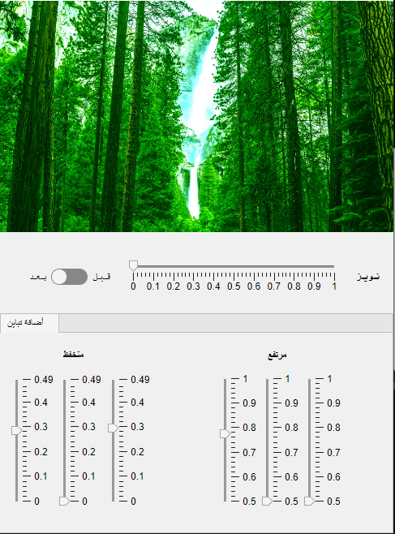

**MATLAB Image Filter App**

This MATLAB application lets you apply various filters and adjustments to your images. It's created using the MATLAB App Designer for a user-friendly graphical interface.

**Features:**

-   Load images in common formats (JPG, PNG, BMP, GIF, TIFF)
-   Add Gaussian noise for a grainy effect (adjustable level)
-   Adjust image colors using separate sliders for red, green, and blue channels (low and high values)
-   Switch between the original and modified image for comparison
-   Enable/disable filters and adjustments as needed

**Requirements:**

-   MATLAB with Image Processing Toolbox

**How to Use:**

1.  **Download and Run the App:**

-   Save the MATLAB code file (**.mlapp**) in your desired location.
-   In MATLAB, navigate to the directory containing the file and run it using the `run` command (e.g., `run image_filter_app.mlapp`).

2.  **Load an Image:**

-   Click the "Select Image" button.
-   Choose an image file from your computer and click "Open".

3.  **Apply Noise (Optional):**

-   Use the slider labeled "Noise" to adjust the level of Gaussian noise added to the image. Drag the slider to the right to increase noise.

4.  **Adjust Image Colors:**

-   Each color channel (Red, Green, Blue) has two sliders: Low and High.
-   Drag the Low slider to adjust the minimum intensity for that color.
-   Drag the High slider to adjust the maximum intensity for that color.

5.  **Compare Original and Modified Image:**

-   Use the toggle switch labeled "Original/Modified" to switch between the original image and the image with applied filters.
